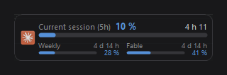

# Claude Usage Widget

A discreet, always-on-top Windows overlay showing the usage limits of your Claude subscription. The display name is "Claude Usage Widget"; the internal identifiers (executable `ClaudeUsage.exe`, settings folder `%APPDATA%\ClaudeUsage`) stay unchanged.



Limits shown:

- 5-hour session
- Weekly, all models
- Weekly, per model

Each row shows a progress bar, the percentage used and the time left before the reset. The overlay only appears while a `claude` process is running (Claude desktop app or Claude Code) and hides itself otherwise.

## How it works

- Data comes from the account endpoint `https://api.anthropic.com/api/oauth/usage`, polled every 5 minutes and only while the overlay is visible. No model usage is consumed. On a 429 response the Retry-After delay is honored before any new attempt, and that deadline is stored in the settings so a restart of the application does not send a request until the pause has elapsed.
- The access token is read locally from `%USERPROFILE%\.claude\.credentials.json`. It is never written, logged or sent anywhere other than the Anthropic API.
- Presence detection checks every 5 seconds for a process named `claude`.
- A tray icon gives access to the menu at all times and raises a notification when a limit resets, even while the overlay is hidden, as long as the application is running.

## Requirements

- Windows 10 or newer
- .NET Desktop Runtime 8.0

## Build and install

```powershell
powershell -ExecutionPolicy Bypass -File build.ps1
powershell -ExecutionPolicy Bypass -File build.ps1 -Install
```

The first call runs the tests then publishes `dist\ClaudeUsage.exe`. The second also copies the executable to `%LOCALAPPDATA%\Programs\ClaudeUsage` and launches it; use that copy day to day so a rebuild never overwrites the running executable.

## Usage

- Drag with the left button to move the window; the position is remembered.
- Right-click (on the overlay or the tray icon): Refresh, Opacity, Notify on limit reset, Alert near limit, Test notification, Launch with Claude Code, Send to tray, Quit.
- "Send to tray" hides the window while keeping the icon and tracking active; the entry becomes "Show" to bring it back. A left click on the tray icon also toggles the display.
- The tray icon reflects usage: three mini bars colored by severity, and its tooltip shows the percentages.
- "Alert near limit" opens a submenu per limit (session, weekly, model) where you pick the alert threshold as a percentage (or Disabled). When the chosen threshold is crossed and again at 100%, a notification is raised, in addition to the reset. Default threshold: 90% per limit.
- While dragging, the window snaps to the screen edges.
- The percentage reflects real account usage: it only changes when you use Claude, or drops on a reset. The countdown is computed locally: when it reaches zero it waits one minute, raises the notification, then restarts for the next cycle, with no extra request. Polling only refreshes the percentages, at a constant cadence.
- Settings are stored in `%APPDATA%\ClaudeUsage\settings.json`.

## Languages

The interface follows the Windows display language. Translations are embedded in the executable (`translations.json`) for around forty languages; English is the default and the fallback for any missing language or key. Resolution follows the Windows culture chain (for example `fr-CA`, then `fr`, then `en`). Date and time formats follow the Windows regional settings. To override or add translations without rebuilding, drop a `translations.json` file with the same structure next to the executable: its values replace the embedded ones.

## Automatic launch

The "Launch with Claude Code" option manages a SessionStart hook in `%USERPROFILE%\.claude\settings.json`: when checked, the hook is present and every Claude Code session starts the overlay; when unchecked, the hook is removed. The rest of the file is preserved as is. The application exits on its own about 30 seconds after the last `claude` process disappears. Opening the Claude app only for chatting, without a session, does not trigger the launch.

## Degraded states

- "Token not found": the credentials file is missing; open Claude or Claude Code to regenerate it.
- "Token expired": the local token is no longer valid; it will be refreshed by Claude Code on its next use.
- Dimmed display: last known value kept during a network error; retried each cycle.

## Known limitations

- Exclusive fullscreen windows (games) can cover the overlay.
- Notifications respect the Windows Focus Assist and can be hidden by it.
